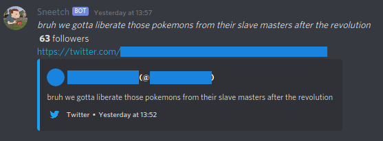

# Sneetch
A Discord bot written in Python that notifies a specific channel of a server of a Twitter account's latest tweet.

## Preparations & Prerequisites
* Owning a Discord and Twitter account (_duh_).
*  Applying for a  (it takes some form filling and half a day, give or take) to create an App through the Twitter Developer Account in order to generate the 4 useful keys (`API key`, `API secret key`, `Access Key`, `Access Secret Key`) to be used in the python script for authentication.
* Creating a bot application through  to get the bot's token and toggling the  to get the ID of the channel where the notifications are going to be posted.
* Having Python 3.6.10 or higher on your system (this is important, since `discord.py` doesn't work in older versions anymore).
*  Installing  and .

## Setting Up the Bot
You can modify the application accordingly to your needs based on:
* The Twitter account it's snitching.
* The Discord channel of a server where it notifies for each new tweet (note that **the channel ID to be put in the source code should be an integer, not a string**).
* The time of updating/checking up if the Twitter account has posted a new tweet yet (checking for new tweets every minute by default).

## Execution Guide
`python3 bot.py`

## Example of Usage

